# ReCapProFrontend

This project is the Frontend part of the [(Rent A Car)](https://github.com/htcoztrk/ReCapProject/tree/master/ReCapProject) project that I have created to rent a car online.
This project was generated with [Angular CLI](https://github.com/angular/angular-cli) version 11.2.3.

## Table of Contents
<ul>
  <li ><a href="#register">Register</a></li>
  <li href=""><a href="#login">Login</a> </li>
  <li ><a href="#carlist">Car List</a></li>
  <li ><a href="#carfilter">Filter Car</a></li>
  <li ><a href="#cardetail">Car Detail</a></li>
  <li ><a href="#rentacar">Rent A Car</a></li>
  <li ><a href="#payment">Payment</a></li>
  <li ><a href="#brand">Brands</a> </li>
  <li ><a href="#color">Colors</a> </li>
  <li ><a href="#profile">Profile</a></li>
 </ul>

## Usage

Register:
Kullanıcı sisteme kayıtlı değil ise, kayıt olarak Login sayfasına yönlendirilir:
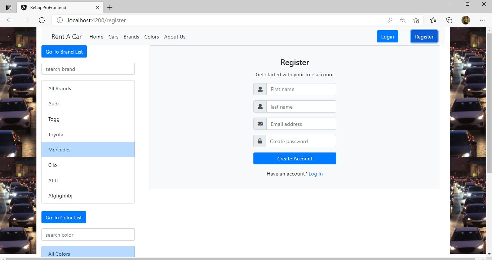

Login Page: 
Kullanıcı bilgilerini girdikten sonra token oluşturulur ve sisteme giriş yapar.
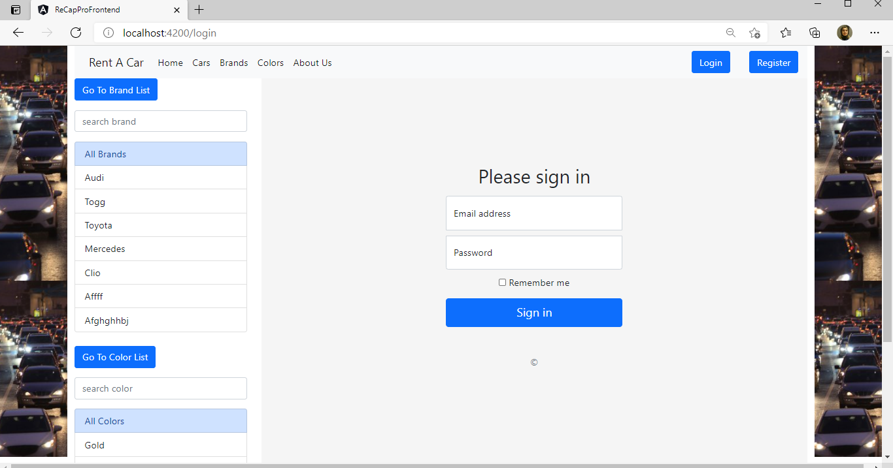

 

Cars: Anasayfada araba listesi bulunmaktadır. 
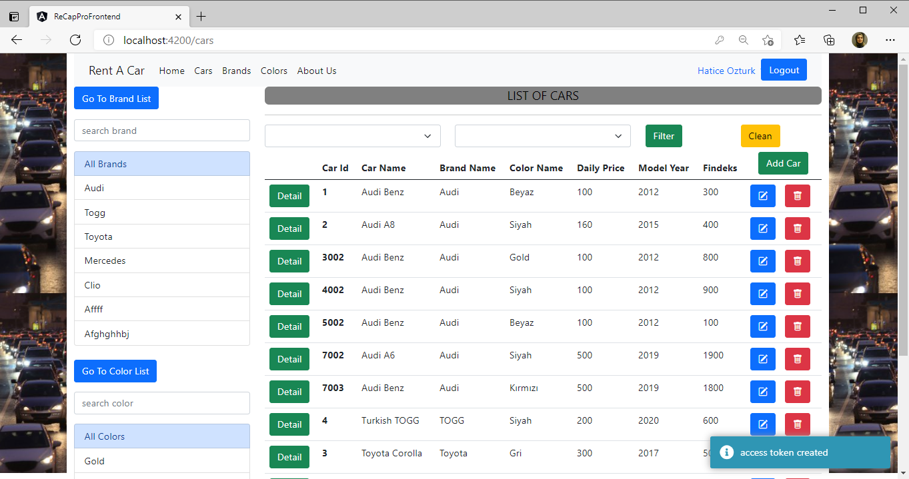

Filter: Kullanıcı renk ve marka seçerek arabaları filtreleyebilir.
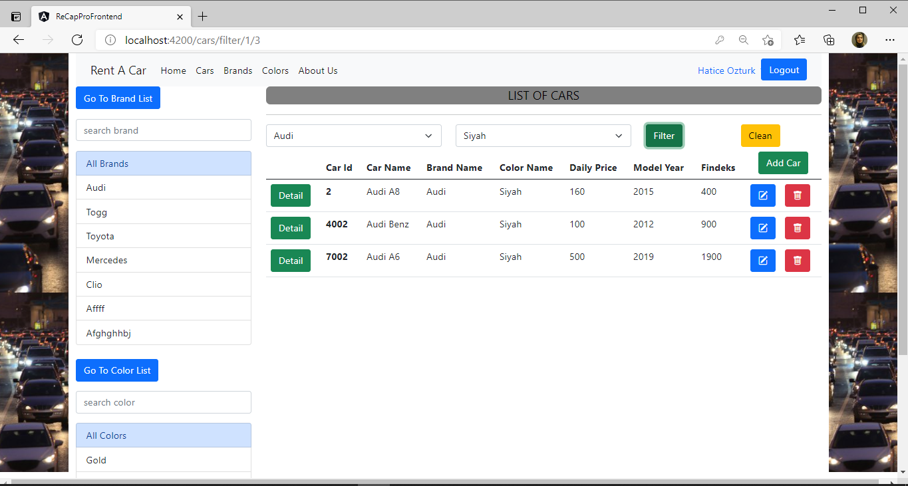

Car Detail: Kullanıcı araba detayına tıklayarak arabaya ait detay sayfasını görüntüleyebilir.
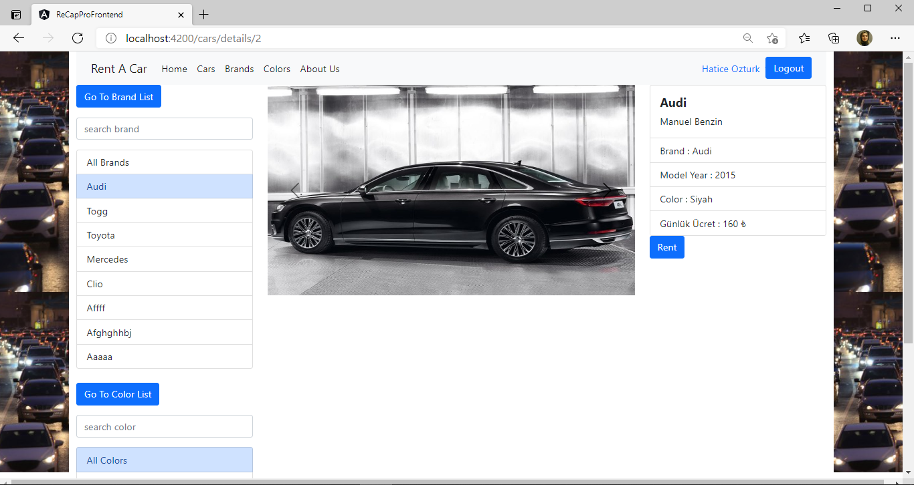

Car Add: Araba ekleme için sisteme giriş yapan kullanıcı araba ekleme yetkisine sahip ise araba ekleyebilir. 
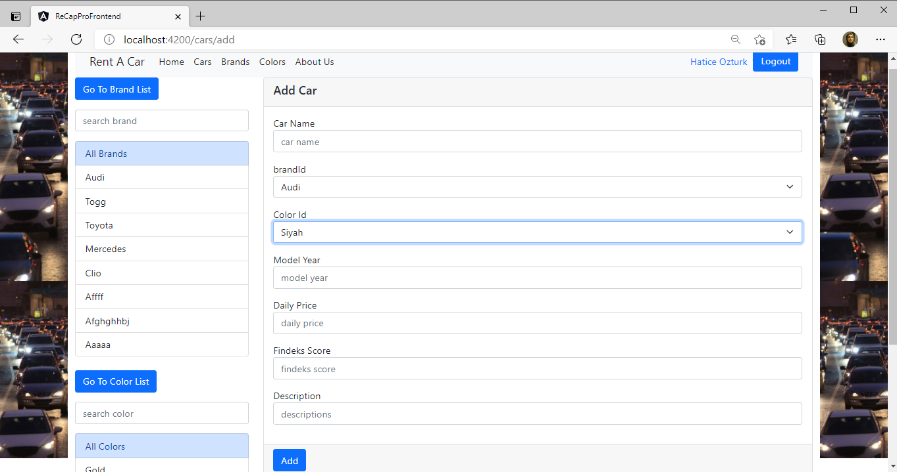

Rent Car: Kullanıcı, detaylarını görüntülediği arabayı,findeks puanı yeterli olduğu durumda tarihleri belirleyerek arabayı kiralayabilir. Aynı zamanda seçtiği tarih aralığında arabanın kirada olmaması kontrol edilir. Araba kiralanabilir durumdaysa, kullanıcı ödeme sayfasına yönlendirilir. 
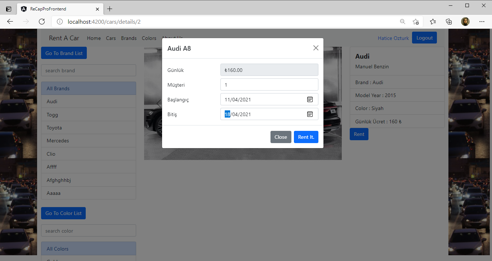
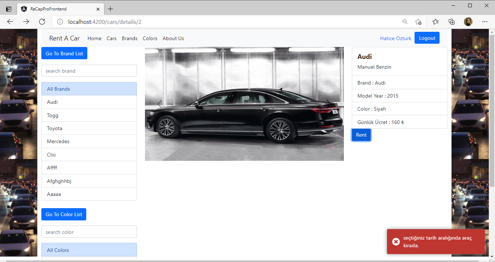
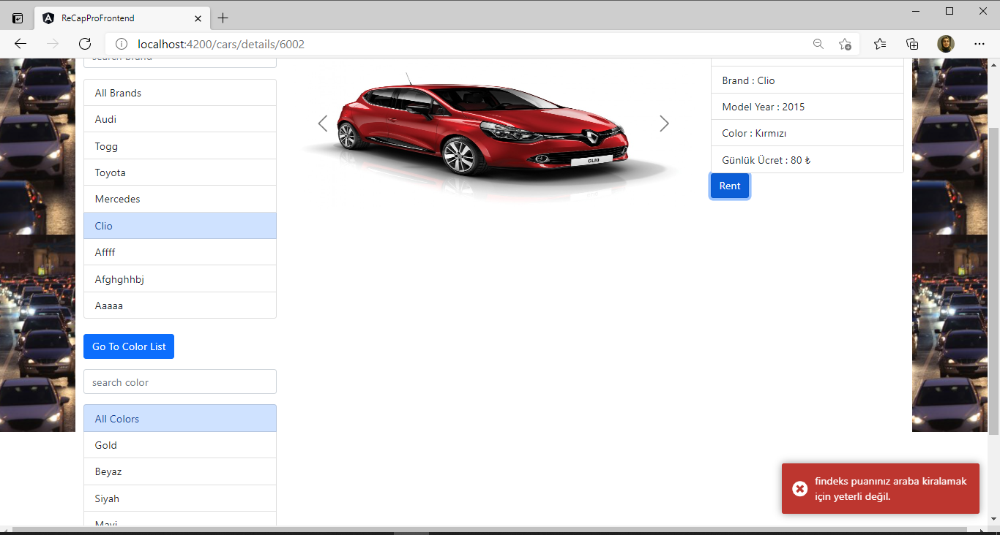
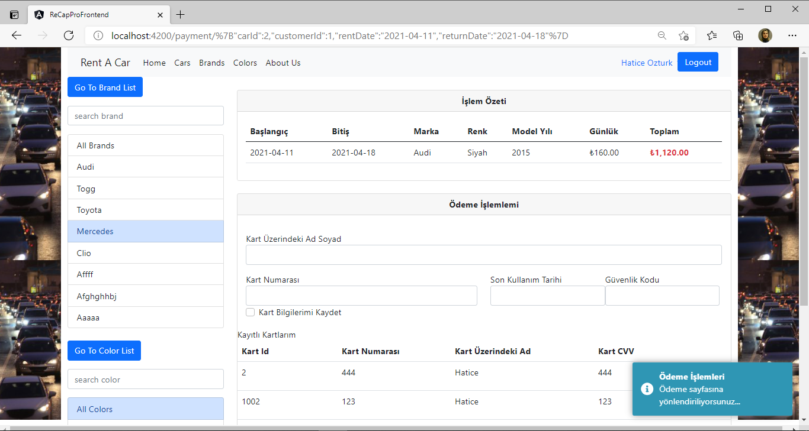

Payment:
Ödeme sayfasında işlem özeti bulunur ve ödeme tamamlanması için kart bilgileri girilir. Kullanıcıya Kart bilgileri kaydetme seçeneği sunularak bir sonraki ödemelerde kayıtlı kartları görüntülenir.
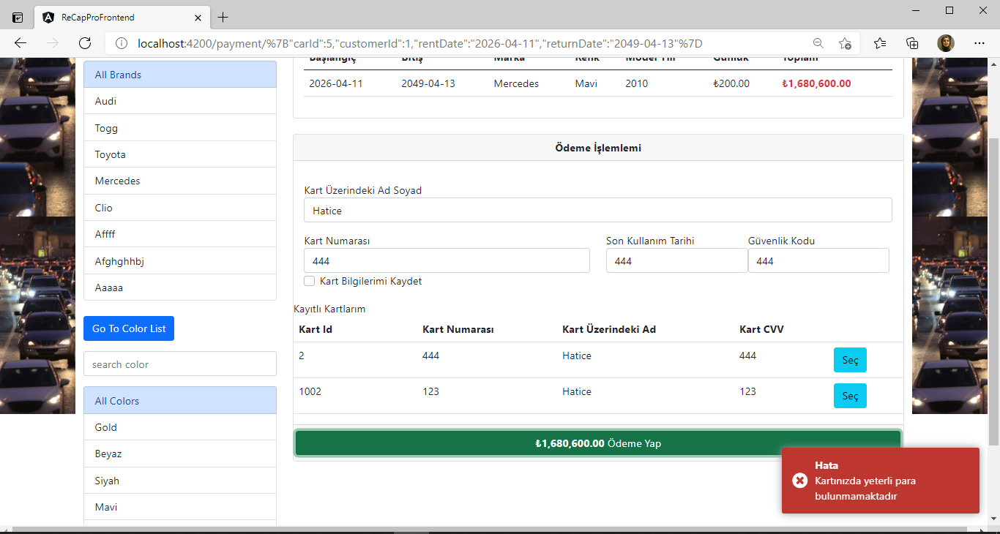
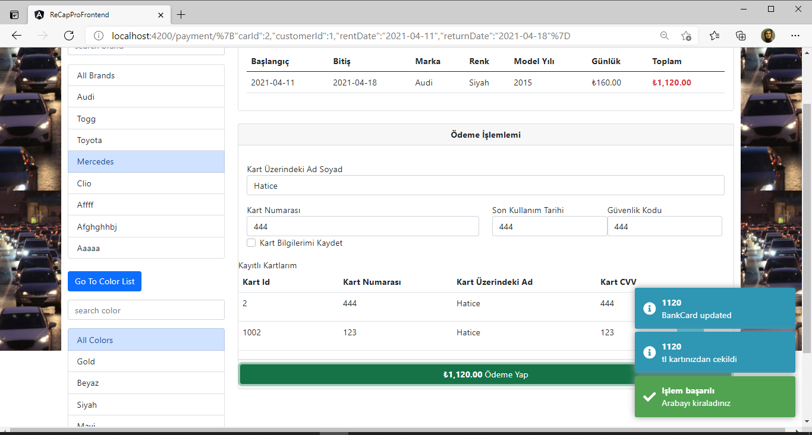

Brand: Markalar listelenebilir, marka ekleme, silme ve güncelleme işlemleri yapılabilir.

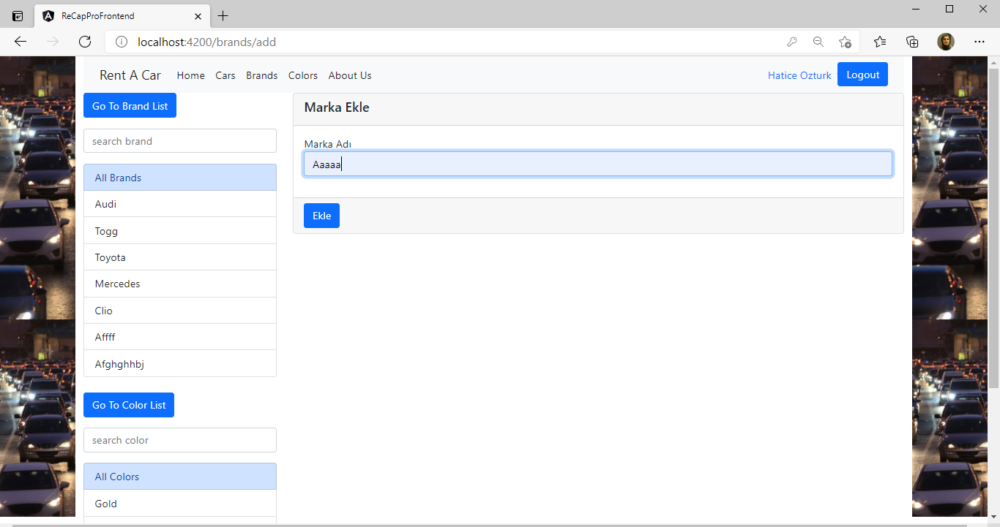
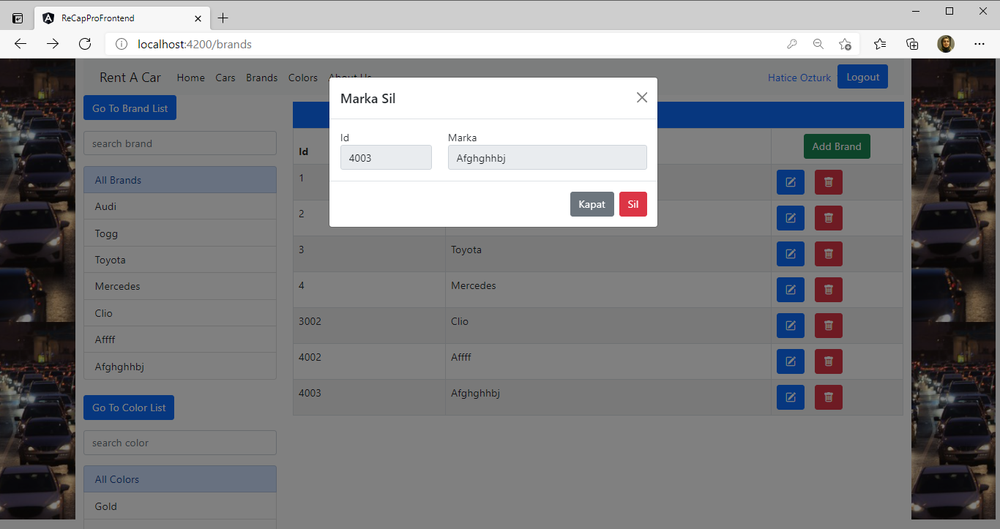

Color: Renkler listelenebilir, renk ekleme, silme ve güncelleme işlemleri yapılabilir.
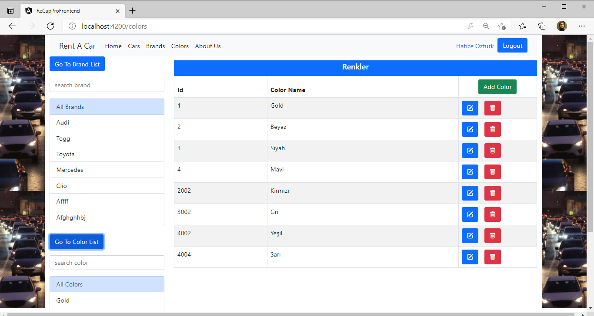
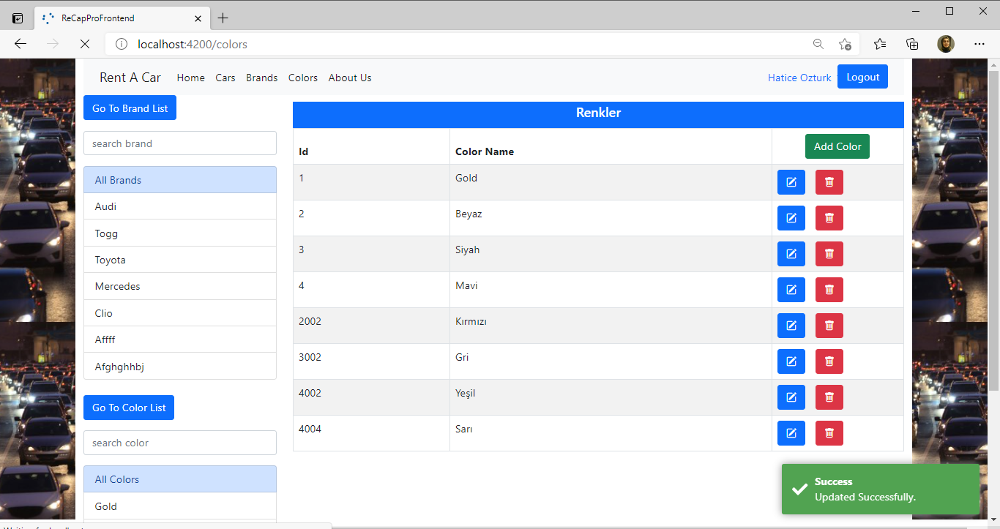

Profile:Kullanıcı profiline girerek bilgilerini güncelleyebilir. Aynı zamanda MyRental kısmından kiraladığı araç bilgilerini görüntüleyebilir.
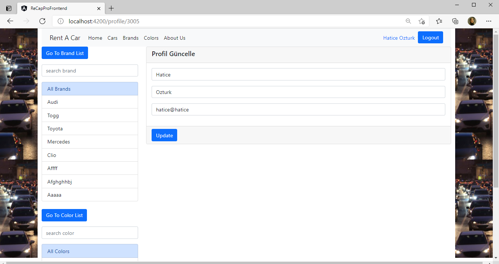
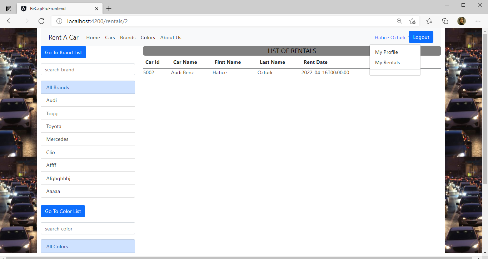

